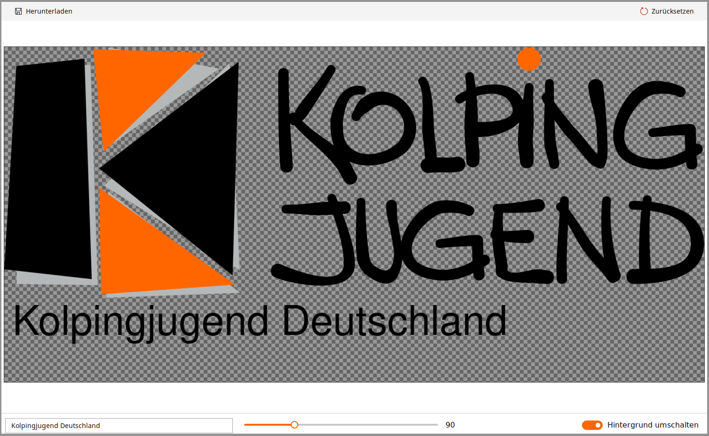

# Kolpingjugend Logogenerator

This project provides a generator to create the official logo of the "Kolpingjugend", known international as "Kolping Youth".

It's a simple, non-localized open source web application based on React and Redux.  
The official deployed version can be found at [logogenerator.kolpingjugend-metzingen.de](https://logogenerator.kolpingjugend-metzingen.de/)

Logos created by this generator can be used without violating the [logo guidelines](https://www.kolpingjugend.de/fileadmin/user_upload/Service/News/2015/11/003_Logorichtlinien.pdf) of the Kolping Youth Germany.

## License

MIT License